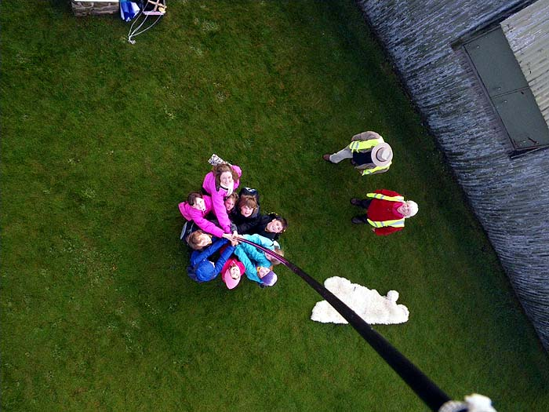

#aerial photography

## Introduction

# Learning objectives

* What are the components of a computer,
* Sequences and Loops as fundamental concepts in programming,
* Writing a simple program,
* Computers can control cameras, and can be small and light,
* Hydrogen is a way to get lift for a balloon,
* Hydrogen is also a way to store energy.
* Use maths to find something useful - how many balloons required.

# Resources

* Scales,
* Raspberry Pi,
* Pi camera,
* Hydrogen,
* Balloons,
* Lots of little strings,
* Long string on a winder,
* Fuel cell flashing light demo,

# Lesson summary

* We're going to build an aerial photography robot!
* What's in the payload?
* Writing a program and using a loop.
* How to get lift. 
* Launch, photos and recovery
* Plenary

## Introduction

Explain to the kids that we're going to build an aerial photography platform to take photos from 20 meters up in the air. We need their help to get it to work.

Q: What do we need to make this happen?
A: a payload with a camera that can take lots of photos,
A: a balloon to lift it in the air.
A: something to power it.

## Lift

Q: How can we get lift?
A: With a gas that's lighter than air, or hot air, or propellors like a helicopter. We're using hydrogen today. Which has a lift of 1.2g per litre.

Q: How much lift required?
A: We have to weigh the payload (and balloons and strings). Do the weighing and ask kids to write down the number.

Q: How many litres of hydrogen are inside this inflated balloon?
A: We can work it out with maths. Show formula, ask for a volunteer to measure circumference.

Q: How do we go from circumference to radius for the volume formula? Show formula on board.

Activity: Ask kids to fill in worksheets to calculate number of balloons required.

## Payload

Q: what is our payload going to be?
A: camera, but how do we get it to take photos over and over? Use a computer

Q: what's inside a computer?
A: show picture of Raspberry Pi and explain components: CPU, memory, USB ports, power socket, GPIO

Optional activity: draw your favourite component onto your balloon.

Activity: program your robot - ensure only 90 degree left and right turns are used and course contains a diagonal. How can we solve the repetion? Loops.

Show kids how we build a sequence, and then add a loop to repeat it in Scratch.

Q: what would our program to take photos look like in Scratch?

Activity: hand out printed scratch blocks and get kids to arrange on the table in front of them. Kids in groups of 4.

## Power

Q: How can we get the power?

Q: Did you know we can use hydrogen as a way of storing energy?

Demonstration of a fuel cell powering a flashing light.

## Raspberry Pi

Hook up Pi to the projecter and use a keyboard and mouse. Load the program and show it to the children.

Start it running, show how it flashes a light and takes a photo.

Show an example photo.

## Launch!

* go outside and all fill balloons
* tie all together - use something to tie it all
* pay out Raspi
* get kids to spell out words on the playground
* wind back

## Plenary

what did we learn?

* computers aren't only laptops
* writing a loop and flashing a light
* we can write programs that do cool things outside
* hydrogen is a gas we can use for lifting and powering

## Get photos off

copy to USB stick and lend to the teacher.

