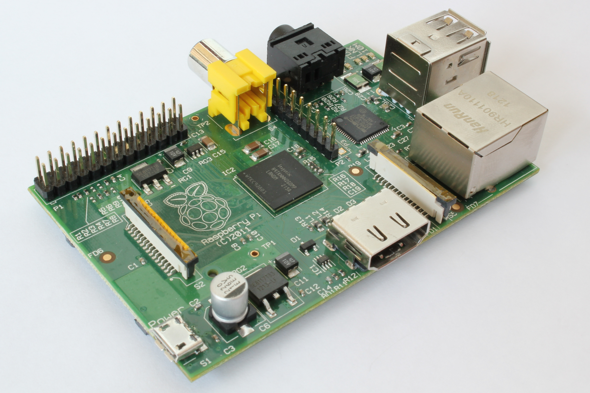

# Aerial Photography

## Introduction

This workshop uses hydrogen to lift and power a Raspberry Pi computer that then takes photos from 20m up in the air. 
Children design the program, calculate the amount of hydrogen needed and then take some aerial photos.

# Learning objectives

* Main components of a computer,
* Sequences and Loops as fundamental concepts in programming,
* Writing a simple program,
* Computers can control cameras, be small and light,
* Hydrogen is a way to get lift for a balloon,
* Hydrogen is also a way to store energy.
* Calculate how many balloons required to lift the computer.

# Resources

* Scales
* Raspberry Pi,
* Pi camera,
* 200L Hydrogen,
* Fuel cell and regulator,
* 200g weather balloon,
* Long string on a winder,
* Fuel cell flashing light demo,
* SD card reader.
* 15 [copies of the handout](aerial-handout.html)

# Preparation

* [Risk assess](riskassess.pdf) the launch area. 
* There must be no over head wires 50m in all directions from the launch spot.
* Hydrogen stored outside with both valves closed,
* Balloon filled outside.
* Balloon emptied on site, not given away.

# Lesson Plan

* We're going to build an aerial photography robot!
* What's in the payload?
* Writing a program and using a loop.
* How to get lift. 
* Launch, photos and recovery.
* Plenary.

## Introduction : 10 minutes

Explain to the children that we're going to build an aerial photography platform to take photos from 20 meters up in the air. We need their help to get it to work.

Q: What do we need to make this happen?

A: a payload with a camera that can take lots of photos,

A: a balloon to lift it in the air.

A: something to power it.

## Payload : 5 minutes

Q: what is our payload going to be?

A: camera, but how do we get it to take photos over and over? Use a computer

Q: what's inside a computer?

A: show picture of Raspberry Pi and explain components: CPU, memory, USB ports, power socket, GPIO

### Program your robot : 25 minutes

The most fundamental part of programming a computer is understanding that programs are made up of a sequence of commands.

It’s important for us to also understand that a computer doesn’t have any intelligence - it has to be told exactly what to do. So when the program is wrong, the computer does the wrong thing.

We want to help the children realise the importance of loops by making them repeat their commands many times.

Ask the students to design a (simple) obstacle course by moving chairs about. Have a start and end point. Ensure there is a diagonal section.

Ask the students what commands the robot will need, and to write them down on their handouts. For example `forward` will make the robot take 1 step forward. Ensure only 90 degree left and right turns are used.

And we always have a `start` and `stop` code with associated sound effects!

Ask the students to write down a program in their handouts that will navigate a robot successfully through the obstacle course.

Now ask for a volunteer robot and a volunteer programmer to see how well they complete the course. Force the robot to follow the programmer's instructions exactly. Computers have to follow the exact instructions given.

The programs will include lots of repetition because we have the diagonal and only left 90 and right 90 turns. 

Q: how can we reduce the amount of writing we have to do?

A: loop some parts of the program.

Show on the projector a simple Scratch program that does what our robot had to do:

Then adjust the program to create a loop:

### Scratch program : 10 minutes

Q: what would our program to take photos look like in Scratch?

Activity: hand out printed scratch blocks and get children to arrange on the table in front of them. Kids in groups of 4.

## Power : 15 minutes

Q: How can we get the power?

Q: Did you know we can use hydrogen as a way of storing energy?

Demonstration of a balloon of hydrogen supplying a fuel cell that's powering a bright LED.

Q: And where can we get Hydrogen from?

A: Formula of water, break it with electrolysis.

## Lift : 15 minutes

Q: How can we get lift?

A: With a gas that's lighter than air, or hot air, or propellors like a helicopter. We're using hydrogen today. Which has a lift of 1.2g per litre.

Q: How much lift required?

A: We have to weigh the payload (and balloon and string). Do the weighing and ask children to write down the number.

Q: How big do we need the balloon to get the required lift?

A: We can work it out with maths. Show formula, ask children to work through worksheet.

$volume = \frac{4\pi r^{3}}{3}$

Q: How do we go from circumference to radius for the volume formula? Show formula on board.

$c = 2\pi r$

Activity: Ask children to fill in worksheets to calculate number of balloons required.

## Raspberry Pi : 5 minutes

* Hook up Pi to the projecter and use a keyboard and mouse. Load the program and show it to the children.
* Start it running, show how it flashes a light and takes a photo.
* Show an example photo.

## Launch! : 30 minutes

* Go outside to designated and risk assessed area,
* Fill balloon,
* Pay out Raspi,
* Take some photos!
* Wind back the balloon.
* Deflate balloon.

## Plenary : 10 minutes

Questions to ask:

* What are the essential parts of a computer?
* How do we avoid repeating ourselves as programmers?
* How much hydrogen do we need to lift the computer?

# Cleanup

## Get photos off the Pi.

Power down the Pi and use an SD reader to copy the photos onto the teacher's computer.
